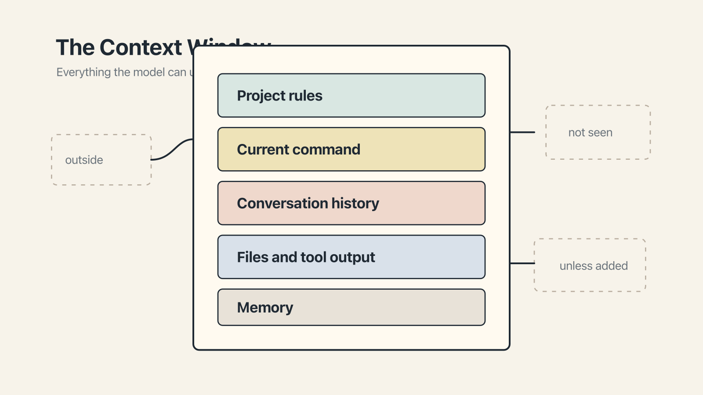

# Chapter 1 — The Window Is the World

A few years ago — though in the accelerated time of machine learning it feels like several careers ago — a new kind of assistant arrived in our working lives.

It could draft an email while you fetched coffee. It could explain the history of Byzantine diplomacy as cheerfully as it could debug a line of JavaScript. It had read, in some useful sense, rather more of the internet than any reasonable person ought to, and it would happily tell you about any of it, at any hour, for what worked out to pennies on the dollar.

There was only one catch.

After about twenty minutes of genuinely impressive collaboration, it would quietly begin to lose its mind.

Not spectacularly. Not all at once. It would simply start to forget. A constraint you had set at the top of the conversation — *please use only the existing design tokens* — would go missing, and the assistant would produce something beautifully polished that used five new ones. You would correct it. It would apologize, thoughtfully and at length. Ten minutes later, it would do the same thing again.

This has happened to everyone who has worked with these tools for any length of time. It has happened, for what it's worth, to the engineers who *build* these tools, though they tend to bring a more technical vocabulary to their swearing. It is not a sign that the model is malfunctioning. It is not, on the whole, a sign that you are doing something wrong. It is the consequence of an architectural fact about how these systems work, and once you see it, you cannot unsee it.

The fact can be stated in a single sentence, and it is the thesis of this entire book:

**Drift is a context problem, not a model problem.**

It is also, as it turns out, a problem you can do something about — provided you understand, in plain terms, what the model actually sees when it is trying to help you.

## What the model sees

When you send a message to an AI — ChatGPT, Claude, Gemini, Cursor, Copilot, any of a dozen others — the model does not receive "your message." It receives a single very long document, assembled just-in-time by whichever tool you are using. At the top sits the vendor's invisible boilerplate (*you are a helpful assistant*, and quite a lot else besides). Below that, in a predictable order, sit the things that have accumulated over your work together: files you've attached, rules you've set, results from tools the model has called, everything you've said, everything it has said back. Finally, at the bottom, what you just typed — which in the grand scheme of this document is often a rounding error.

All of this fits inside a thing called the **context window**, measured in tokens (which are, roughly, three-quarters of a word each). The window is the model's entire world for the duration of this turn. If something is not in the window, the model does not know about it. There is no hidden compartment. Every time you press Return, the document is reassembled on the fly, handed to the model, and re-read from scratch. The model's only reality is that document.

This contradicts the conversational experience of actually using one. You feel, quite naturally, that you are *talking* to the model, the way you talk to a colleague. The model is very good at imitating that experience. It is not, however, what is happening.

## The brilliant new hire

Here is a mental image worth carrying through the rest of the book.

Imagine that you have, as of five seconds ago, a brilliant new hire. They are, by any fair measure, remarkably smart. They have read more than most of your team. They are quick, cheerful, tireless, and largely without ego.

What they do not have is any particular knowledge of your world. They do not know what your team decided last quarter. They do not know which design patterns are sacred and which are merely tolerated. And — here is the catch that makes the metaphor work — they will walk in new every morning. Every conversation is Day One.

That is, essentially, what it is like to work with a large language model. The model is the new hire. The context window is the package of papers you hand them as they sit down at the desk. What you put in that package is, to a degree that is not intuitive at first, the thing that determines how good their day will be.

## Everything competes

One more thing before we set about exploring the window.

The window is not organized. It is not sorted by importance. Everything in it — the vendor's system prompt, your carefully written rules, a Figma screenshot, a 200-line stack trace, an offhand joke from thirty minutes ago, your latest instruction — all of it sits in the same bucket, competing for the same attention.

Attention is the operative word. Every turn, the model allocates what is, in effect, a finite budget of focus across the entire document. If the document is small and tidy, that budget goes a long way. If the document is cluttered — ninety percent tool output that nobody will ever reread, with a critical three-line constraint buried somewhere in the middle — the budget gets diluted. The model, doing its best, will produce something reasonable. Reasonable is not always what you wanted.

There is a lovely, terrible consequence of this, which the rest of Part I will explore: **the right fifty lines outperform five thousand lines of everything.** More context is not better context. This runs against most of the tutorials you will read online, and against the way AI tools tend to be sold. ("Upload your entire codebase!" they announce, winking.) It is nonetheless true.

## One window, many windows

A small note, because the book is about LLMs in general and not any one of them.

Every frontier model has a context window. Sizes in the current generation run from around 128,000 tokens at the low end to just over a million at the top. Cursor, Copilot, Aider, Windsurf, and most other tools use whichever window belongs to whichever model you have pointed them at. The details differ by vendor; the architecture is shared.

These are the advertised numbers, and they are very large indeed. In the next chapter we will see what happens when we ask how much of that window the model can *actually use* — which, spoilers, is rather less than it says on the box. For now, the only thing that matters is this: **there is only one window, and it is the world.** Treat it accordingly.
