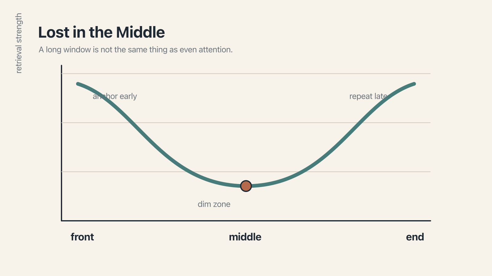

# Chapter 3 — Lost in the Middle, Still

There is an odd genre of blog post that appears, with dependable frequency, several times a year. It is written in the slightly surprised tone of a person who has just opened a pantry and found it larger than they had supposed, and it announces, essentially, that the old problem of language models being forgetful in the middle of their context has been solved.

The latest architectural trick has done it. The newest attention mechanism has fixed it. The middle, the post reports, now lights up just like the ends. We can stop worrying about where to put things in our prompts and get on with our lives.

Except that, as anyone who has spent any time putting things in their prompts and then watching them vanish will have noticed, we cannot.

The U-curve is real and repeatable, as the last chapter established. What I want to do in this one is explain *why* — and, more specifically, why it has been, despite a great deal of well-meaning effort, very hard to get rid of.

The short version is that the U-curve is not a bug. It is a geometric consequence of how modern language models are built. To make it go away permanently, you would need to change the architecture of the transformer itself — which has been tried, which has produced real improvements in the lab, and which has not yet made its way into the models you actually use.

## Why the middle is dim

The answer lies in a piece of the transformer architecture that is easy to overlook, because it is usually explained in the kind of mathematical notation designed to repel casual inquiry. It is called **causal masking**, and it is the thing that makes a modern language model write in one direction.

When a model reads a prompt, it does not quite see all the tokens at once. It sees them, but it reads them under a strict rule: each token is allowed to look only at tokens that come before it, never at tokens that come after. That is what *causal* means here — cause before effect. It is this rule that forces the model to generate text left-to-right, one token at a time, each new token building on the ones already in place.

It is, in a sense, the same way you are reading this sentence. You do not know what the end of the sentence says until you get there. You have to proceed word by word.

The geometric consequence of the rule is unsubtle, once you see it. A token near the beginning of the prompt has nothing ahead of it. Every single token that comes later will, at some point, be able to attend back to it. So it gets a great deal of attention flowing through it — a kind of early-mover advantage. A token near the end, meanwhile, is the thing that has to pull on all its predecessors to produce the next output. It too gets a lot of attention, though of a different kind.

A token in the middle is in the worst of both worlds. It has most of its context to reference, which is a lot of work. But most of the sequence *after* it is referencing past the middle, back to the early tokens, for the early-mover reasons already described. The middle is, in short, structurally thin on attention. This is not a quirk of training, or a tuning failure, or something a better dataset could fix. It falls out of the mathematics the moment you assemble a decoder-only transformer.

There is a second factor worth naming, which is positional encoding. Models learn not just what each token means, but where it sits in the sequence. Most current frontier models do this with a family of schemes descended from **rotary positional embedding** — RoPE, in the jargon — which has a subtle property: the further apart two tokens are in the sequence, the less their learned representations can cleanly interact. At short distances, the model connects things sharply. At long distances, the connection degrades, a bit like trying to hear a whispered conversation through progressively thicker walls.

This matters because the middle of a long prompt is, by definition, far from both ends. The beginning struggles to reach forward to it. The end struggles to reach back.

## The attempts to fix it

Research groups have not been ignoring all this. There is an entire sub-field dedicated to teaching models to pay better attention to their middles, with intriguing names like *Multi-scale Positional Encoding* and *Found in the Middle*. Some of these methods, tested on academic benchmarks, produce real improvements — the U-curve flattens, or rotates, or becomes somewhat less pronounced.

But — and this is where we come to the honest part of the chapter — none of them have yet been deployed at the frontier. The models you are most likely using day-to-day (GPT-5, Claude Sonnet 4.6, Gemini 2.5 Pro, the latest Llamas) all use variants of the same causal-masking-plus-RoPE architecture that produces the U-curve in the first place. The proposed mitigations remain, for the moment, in the lab. And even the ones that work in the lab work only partially. As of this writing, no frontier model has been shown, on an independent benchmark, to be completely free of middle-drift.

You may find this slightly frustrating. You are not alone. The fix, in a strict sense, is known. The fix has not arrived. In the meantime, we work with what we have.

## Designing for the geometry

This is, in one sense, disheartening news. The marketing gives you a million-token window. The mathematics gives you a million-token window with most of the light at the two ends.

In another sense, though, it is liberating. Once you accept that middle-drift is structural rather than a temporary irritation awaiting its patch, you can design for it. The rules change from *hope the model reads everything* to *arrange the content so the model's natural attention lands on the right things*.

Two habits follow directly from the geometry, and both will recur in the next two chapters in different guises.

The first: **put the most important instruction closest to the ask.** If there is one thing the model absolutely must remember — don't touch the authentication layer, always return JSON, never invent new tokens — say it again, gently, right before the question. The instinct is that this is redundant, because you already said it at the top. The reality is that attention at the bottom of a long prompt is *sharper* than attention at the top, particularly for instructions directly adjacent to the output the model is about to produce. Repetition at the tail is not inelegance. It is arithmetic.

The second: **do not rely on the middle.** Whatever must not be forgotten should be either at the top, at the bottom, or in a rules file (which is re-injected every turn, and so is always effectively at the top). The middle is a reasonable place for reference material. It is a bad place for the one thing.

## Onward

Drift is a context problem. It is also, now, a geometry problem — a consequence of how attention flows through long sequences. There is no setting you can flip to change the geometry. But you can arrange the content within it, and if you do, the model will almost always meet you halfway.

We have been talking about the window as though it were a static thing — a snapshot of everything the model sees, on a given turn. That is not quite the whole picture. The window also changes. Conversations grow, sessions fill up, and the tool surrounding the model does something — quietly, and usually without telling you — to make room.

What happens when the context you worked so hard to assemble starts, slowly and invisibly, to be rewritten by the system itself?

That is the next chapter.
