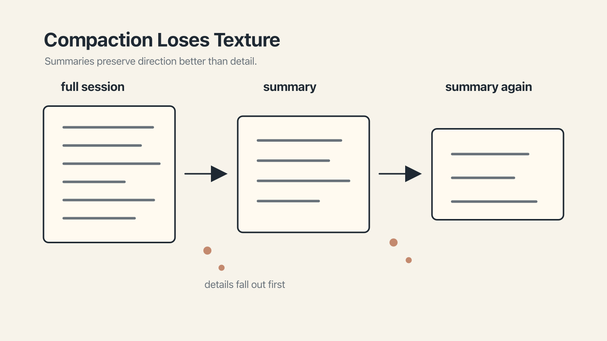

# Chapter 4 — The Screenshot of a Screenshot

If you have ever played the game of Telephone as a child — the one in which a sentence is whispered from one person to the next around a circle, and emerges at the other end bearing a comical resemblance to its original form — you already have an excellent mental model for what happens to a long AI conversation.

The sentence that started as *the quick brown fox jumped over the lazy dog* arrives, after fifteen whispered iterations, as *the thick brown socks bumped over the crazy hog*, and everyone laughs. The game is funny because the meaning survives just well enough to make the drift feel both plausible and absurd.

Long AI conversations are Telephone, more or less. Not at every turn — the model remembers its most recent words perfectly well. But across the longer arcs of a session, something very similar takes hold: early, specific constraints become a vague summary, then the summary gets summarized, and by the time you reach turn forty, what the model thinks you said is often not, in any useful sense, what you said.

There is a name for this, and it is called **compaction**. It is what every major AI tool does when the context window starts to run out of room.

## Why the tool does this

The window, as we have seen, is finite. A conversation that runs for two hours and involves a fair amount of file reading, tool use, and back-and-forth can produce a hundred thousand tokens of material without anyone really noticing. Eventually the window gets close to full, and something has to give.

The choices available to the tool at this point are unappealing. It can refuse to continue — rude. It can drop old turns entirely, which means you have lost everything you said at the start of the session. Or it can try to *compress* the old turns into a shorter form that preserves the gist, if not the detail, and carry on.

Every major tool has chosen some version of compression, extraction, or persistence. Claude Code has a `/compact` command. ChatGPT extracts memories silently and continuously ([announcement](https://openai.com/index/memory-and-new-controls-for-chatgpt/)). Google's Vertex AI Memory Bank, in public preview since July 2025, processes conversations asynchronously and reconciles contradictions over time ([blog](https://cloud.google.com/blog/products/ai-machine-learning/vertex-ai-memory-bank-in-public-preview)). Cursor's Memories persist per-project, per-user ([changelog](https://cursor.com/changelog/1-2)). The tools differ in the details. The shape is the same: when the window fills, earlier material gets turned into something smaller.

## The screenshot of a screenshot

Now for the metaphor, which I cannot claim credit for — it has been knocking around AI training circles for a while — but which is so good I am going to borrow it wholesale.

Compaction is a **screenshot of a screenshot.**

Imagine you took a screenshot of a webpage, cropped it down, saved it. Then, to save more space, you took a screenshot *of the screenshot*, cropped that, and saved it again. Then you did it once more. The final image still, in some loose sense, shows the original page. The shapes are about right. The colors are approximately right. You can tell it used to be a screenshot. But the text is no longer readable. The fine detail is gone.

This is what happens to your conversation. Consider an example, recognizable to anyone who has designed with AI assistance.

You begin a design session and tell the model, clearly, on turn one: *use existing design tokens only — do not invent new colors or spacing values.* The conversation proceeds. You upload a Figma file. The model reads some code. There are a few back-and-forths, a productive tangent about accessibility. At some point the window fills up and the tool quietly compacts. The first summary reads: *the user asked for a component using existing tokens, avoiding new values.* Fine. Slightly expanded, even.

But the conversation continues. You ask for a variant. You iterate on spacing. Eventually the window fills again, and the summary itself has to be summarized. The new summary reads: *the user wants UI polish, discussed tokens and spacing.*

And a few turns later: *the user wants UI polish.*

At which point you ask the model to make the component look a little more premium, and it returns something beautifully polished that uses three new colors and a custom shadow. You are surprised. The model is, from its own perspective, doing exactly what you asked. It no longer remembers the original constraint. The constraint has been summarized out of existence.

This is, in practical terms, the single most common way long AI sessions go wrong. It is not that the model has failed. It is that the model is now working from a version of your instructions that is three generations removed from what you actually said.

## What survives

The good news — such as it is — is that compaction does not erase everything equally. Three things tend to survive.

The first is **your rules file.** Whether it is `CLAUDE.md`, `AGENTS.md`, `GEMINI.md`, or whatever your tool wants, these files are usually re-read from disk every turn. They are not part of the conversation history, so they are not part of what gets compacted. If a constraint lives in your rules file, it is effectively immune to Telephone.

The second is **explicitly saved memory.** ChatGPT's saved memories, Cursor's approved Memories, Vertex Memory Bank's extracted facts. These are distilled once, often reviewed, and persisted as small structured items. They survive compression because they are already short.

The third is **the most recent few turns.** Compaction leaves the recent context intact. Whatever you just said is safe — for a while.

What tends *not* to survive is essentially everything else. Specific constraints mentioned once, conversationally. The reasoning behind a decision you made together four turns in. If it lived only in the chat history, and that chat history has been compacted, it is in the screenshot of the screenshot, and the detail is gone.

## Compact early, not late

There is a piece of advice about compaction that surprises most people the first time they hear it. The advice is this:

**Compact early, not late.**

Most people wait until their tool tells them the window is nearly full — around ninety or ninety-five percent — and at that point run `/compact` or equivalent. This feels thrifty. It is, in fact, the worst time to do it.

By the time your window is at ninety-five percent, two things have happened. First, lost-in-the-middle has been silently corrupting responses for a while, because the middle of your window is now very much a continent. Second, the summary that gets generated will be based on already-drifting memory — the model is, in effect, being asked to summarize its own confusion.

If you instead compact at around sixty percent — while the window is still mostly clean, the middle is still short, and the model's recollection of your early turns is sharp — the resulting summary is substantially richer. Anthropic's own engineers recommend exactly this, in their September 2025 writeup on effective context engineering ([blog](https://www.anthropic.com/engineering/effective-context-engineering-for-ai-agents)). The advice is specific to Claude but the principle generalizes.

Most tools also let you compact with a **focus directive** — *compact, but preserve the pricing constraints* — which tells the summarizer what not to throw away. Use it. A directed summary is meaningfully better than a generic one.

## Anchors and breadcrumbs

Two small habits round out the chapter.

The first is **anchoring.** If something important gets said in conversation — a constraint, a decision, a non-obvious rule — and it matters beyond the current session, move it into the rules file right then. Don't trust Telephone to carry it.

The second is **breadcrumbs.** Before a long break, a switch of tasks, or a planned compaction, leave a short scratchpad of state — what is done, what is next, what the open questions are. The scratchpad is a note from today's you to tomorrow's you. When you come back after a compaction, the breadcrumb will restore more than any summary can.

Together, these amount to a working philosophy: **do not let the model carry state for you.** Carry it yourself, in files you control, in places that do not get compressed.
