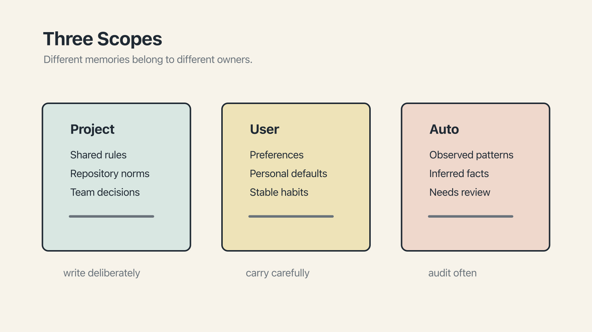

# Chapter 9 — Three Scopes

Suppose you, a working engineer, have finally written the perfect rule. It is short, specific, and has already saved you from the same correction twice, which you know from the last chapter is the point at which a rule earns its place.

The rule is: *when refactoring, preserve public API signatures unless explicitly told otherwise.*

Where should it go?

This is a more interesting question than it seems, because rules live in three different places, for three different reasons, and putting the same rule in the wrong place is about as useful as not writing it at all. There is a natural taxonomy here — three **scopes** — that maps cleanly across every major AI tool, even though each one gives the scopes slightly different names.

This chapter is the conceptual map. The previous chapter gave you the file names.

## The three scopes

They go, from most public to most personal:

**Project scope.** Rules that apply to this codebase, this team, this project. Checked into source control. Everyone working on the project gets them. They leave with the repo.

**User scope.** Rules that apply to you personally, regardless of which project you are in. On your machine, not in source control. They follow you from project to project.

**Auto scope.** Rules the model infers from your behavior over time. You did not explicitly write them. The tool observed you correcting it, extracted a pattern, and persisted the pattern somewhere it can read later. You can review these, but you did not author them.

Different tools implement these differently, but the three-scope frame holds across almost all of them.

## Project scope

This is the scope most people think of first when they hear *rules file*, and it is where most of the content lives. The file sits in the repository. It describes the project. It travels with the code.

Every tool has a file for this (see Chapter 7 for the details): `CLAUDE.md`, `.cursor/rules/*.mdc`, `.github/copilot-instructions.md`, `GEMINI.md`, or the cross-vendor `AGENTS.md`.

The defining feature is source control. Everyone on the team gets the same rules. A new hire clones the repo and inherits the project's conventions automatically. When the team's definition of "ready" changes, you edit the file, commit, and the new definition is what the team's AI sessions work from starting tomorrow. This is the scope that makes rules a team activity rather than a private practice.

It is also where most of what we have been calling invariants belong. The flaky test. The convention about API signatures. The definition of done. These are properties of the project, not of you. Put them in project scope.

## User scope

User scope is about how you, specifically, like to work.

Perhaps you have a preference for what comment style an AI should use when generating Python. Perhaps you prefer brevity over explanation and would rather not have every code block annotated with prose. Perhaps you have a pet vocabulary — a set of terms you consistently use and that the AI, left to itself, keeps replacing with synonyms you don't want. These are personal preferences.

Each tool has its own container: `~/.claude/CLAUDE.md` in Claude Code, `~/.gemini/GEMINI.md` in Gemini CLI, Custom Instructions in ChatGPT, account-level rules in Cursor. The common thread is clear: *me, across projects.*

There is an underappreciated point here: most people never write a user-scope file at all. They write a project file for each repository they work in and leave their personal machine untouched. This is a mistake, though a mild one. If there is some preference you find yourself re-establishing at the start of every new chat — *use British spelling, return short answers, don't explain what you're doing before you do it* — then it belongs in user scope, where you will write it once and inherit it everywhere.

The test for user scope is a twist on the invariant test from Chapter 6: *would I tell every AI I work with, regardless of project or team, to do this?* If yes: user scope. If no: probably project scope, or nothing.

## Auto scope

The third scope is the odd one, because you do not write it. The tool writes it on your behalf, by observing your corrections and extracting patterns.

The mechanisms vary. **Claude Code** keeps auto memory in `~/.claude/projects/<project>/memory/`, with an index in `MEMORY.md` and topic files loaded on demand ([docs](https://code.claude.com/docs/en/memory)). **ChatGPT**'s Memory, since April 2025, has two layers — *saved memories* you can review and *chat history reference* that implicitly pattern-matches your past chats ([announcement](https://openai.com/index/memory-and-new-controls-for-chatgpt/)). **Cursor** Memories went GA in 1.2, per-project, per-user, with user approval for background-generated ones ([changelog](https://cursor.com/changelog/1-2)). **Vertex AI Memory Bank** is Google's production-grade equivalent for developers building agents on Google Cloud ([blog](https://cloud.google.com/blog/products/ai-machine-learning/vertex-ai-memory-bank-in-public-preview)).

The common shape: the model watches what you do, extracts patterns, stores them, and reads them back into future sessions without being asked.

This is remarkable when it works well and awkward when it doesn't. The awkward cases, which you will encounter, include the model extracting a one-time clarification as though it were a standing rule (*you told me once to return JSON; I now always do*), or extracting something you no longer believe (*six months ago you preferred a particular library; the memory hasn't moved on*), or extracting something slightly wrong (*you asked for British spelling in fiction; I now apply it to code comments*).

The discipline here, which few tools make as easy as they should, is **periodic review**. Look at your auto memory. Delete what's stale. Correct what's wrong. Keep what's right. Quarterly is a reasonable default.

## Where the refactoring rule goes

Back to the rule that opened the chapter: *when refactoring, preserve public API signatures unless explicitly told otherwise.*

Where does it go? It depends on *who holds the rule*.

If this is a team convention — we, as a team, preserve public API signatures; it's how we work — then project scope.

If this is a personal preference — I, specifically, hate it when the AI breaks my public signatures, regardless of what team I'm on — then user scope.

If you have been correcting the AI on this for months but never written it down, and the tool has extracted the pattern itself, it may already be in auto scope. Open your auto memory and check. You might find it there — a sign the feature is working, and a cue to promote the rule to project or user scope, which are more durable and easier to share.

The rule is the same either way. The scope depends on whose rule it is.

## For Monday

Two habits, one for each scope you most likely underuse.

First, if you do not have a user-scope rules file, create one. It can be three lines long. Just notice what you keep re-establishing at the start of every conversation, and write it down in one place. Twenty minutes of effort, once, and you will find yourself repeating yourself less for the rest of your career.

Second, open your auto memory. You probably have not looked at it in a while, if ever. Read through the entries. Delete whatever is stale, wrong, or no longer you. Promote anything that has become a real invariant into your project or user file.

This closes Part II. We have now seen what belongs in a rules file, where the file goes, how big it should be, and whose scope it lives in.
