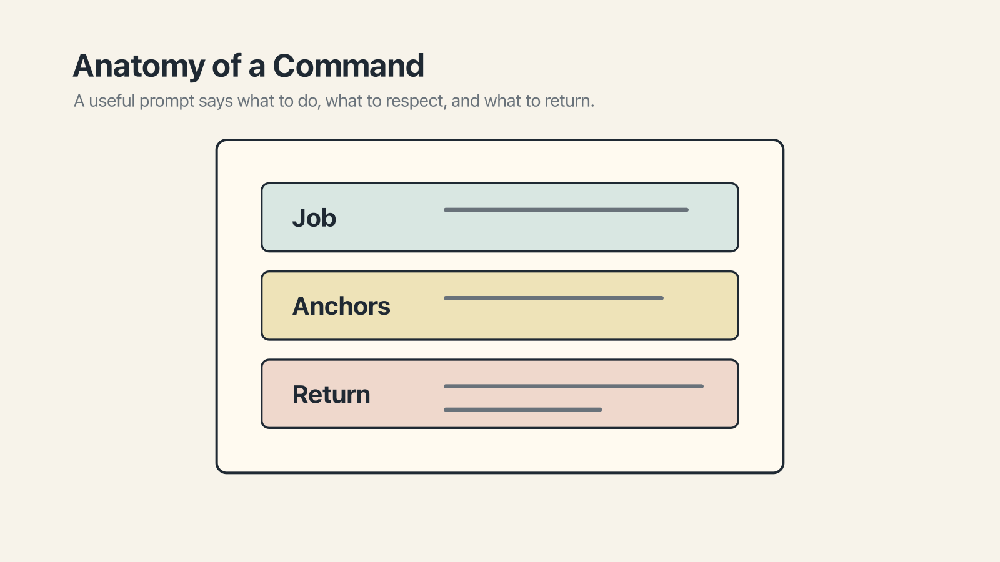

# Chapter 10 — Anatomy of a Command

There is a simple test for whether a command to an AI is going to produce a useful result. Read it back to yourself. If you can imagine five different things the model might do in response, all of them technically correct, the command is not tight enough.

"Check whether these are aligned." Does that mean *tell me yes or no?* Or *produce a report?* Or *rewrite the second one to match the first?* Which are these, incidentally? And aligned against what? It depends, in every case, on what the model happens to guess — which, in turn, depends on what the internet's average guess would be. Which is to say: a wish, not a command.

Part II was about what you tell the model *once*, for every session. Part III is about what you tell it *right now*, for the specific thing you want done. The difference matters. A rules file is standing orders. A command is today's assignment.

A well-shaped command has three parts, and the parts are easy to remember.

The job. The anchors. The return.

## The job

The job is what you are actually asking the model to do. It sounds tautological, but most bad commands fail at this step — they describe a *topic* rather than an *action*, or they describe what the output should be about without saying what to do with it.

*Alignment between our PRD and the current design* is a topic. It is not a job. A job would be: *compare the current PRD with the latest mockup and flag the mismatches.* The verb matters. Compare. Flag. Generate. Summarize. Draft. Review. These are the operative words.

A useful exercise, any time a prompt feels vague: underline the verb. If you cannot find one, the command isn't a command yet.

The job also benefits from being about one thing at a time. *Compare the PRD with the mockup, then write a refactored spec, then summarize for the team* is three commands stacked into one. Models handle stacked jobs — most will cheerfully try — but they handle them worse than they handle one at a time. If you have three things to ask, ask them in three turns.

## The anchors

Anchors are what the model should read, reference, or otherwise attach itself to. Without them, the model falls back to its general knowledge — the internet average — which, as we saw in Part I, is a respectable source for a generic answer and a disastrous source for one that has to fit your particular world.

Some anchors are files. *Read the current PRD at `docs/prd-v3.md`.* Some are folders. *Start in the `checkout/` package.* Some are URLs. *Look at the latest version of this Figma frame.* Some are prior conversation. *Refer to the schema we discussed earlier in this chat.* Some, in tools that support it, are `@`-mentions.

The important property of an anchor is that it is *specific* and *locatable*. "The latest research" is not an anchor; it is a hope. "The research doc in `/shared/research/2026-q2-pricing.md`" is an anchor. If you cannot name the artifact, the anchor is not yet ready to be one.

Include as many anchors as the job clearly needs, and no more. Every anchor is content going into the window, competing for attention. Three focused anchors usually beat ten scattered ones.

## The return

The return is what you want the model to hand back — the shape of the output.

This is the part most prompts skip, on the assumption that the model will "just know" what a good output looks like. It usually does not. What it knows is a wide distribution of possible outputs, some of which are useful, many of which are not.

Specifying the return can be as simple as one sentence. *Return a bulleted list of mismatches, one per line, with a short reason for each.* Or *Return a unified diff, nothing else.* Or *Give me three options, in order of increasing scope, with the tradeoffs for each.*

Three questions worth asking before you hit send: *What form should the answer take? What should and should not be included? What is the stopping condition?* If you do not bound the output, a long conversation will produce increasingly long answers, because the model has no reason to stop.

## A worked example

Here is a prompt, written the bad way:

> Check whether our checkout flow is aligned with what the PRD says.

And the same prompt shaped into a command:

> **Job:** Compare the checkout flow as currently implemented with the checkout section of the PRD, and identify mismatches.
>
> **Anchors:** The current implementation lives in `apps/web/checkout/`. The PRD is at `docs/prd/checkout-v4.md`. The latest Figma frame is the "Checkout v4 Final" frame in the PED Q2 project.
>
> **Return:** A bulleted list of mismatches. For each, note the file or frame where the discrepancy lives and a one-line description. Do not propose fixes — I want the findings first.

The second prompt is longer. It is also, by almost any measure, going to produce a more useful answer, because the model has been told what to do, what to read, and what to return.

The anatomy is universal — same across ChatGPT, Claude, Gemini, Cursor, Copilot, Aider, any frontier tool. Conveniences vary; the anatomy underneath does not. Becoming fluent at writing shaped commands is a transferrable skill.

## For Monday

Two exercises.

First, take the next complex prompt you are about to send, and before you send it, label it silently in your head. *Job here. Anchors here. Return here.* If any of the three is missing or vague, fix it before hitting send.

Second, find a prompt you send frequently — the one you've typed four or five times this month — and rewrite it in the three-part shape. Save it somewhere you can paste from. We come back to saving reusable prompts in Chapter 12.

You will find, after a little while of doing this, that most of the "bad output" you used to ascribe to the model was actually a consequence of unshaped input. The model was doing its best with what you gave it. You can give it more.
