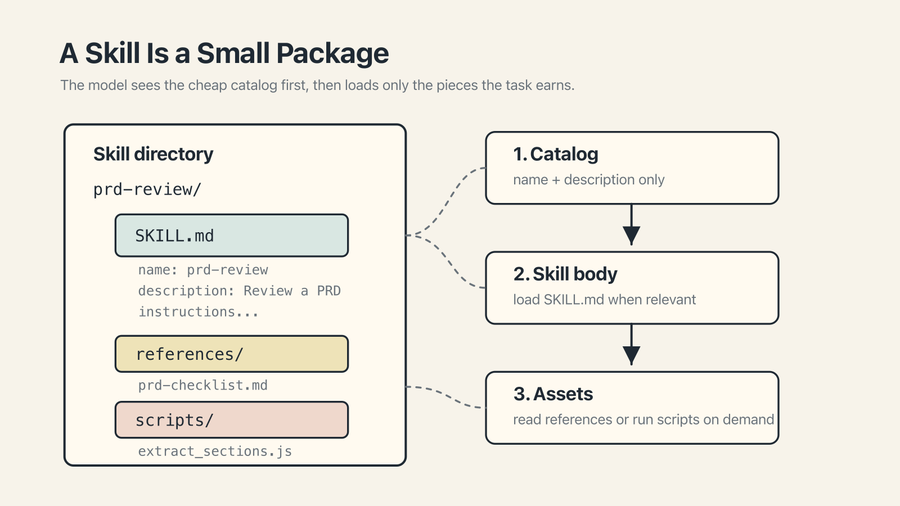

# Chapter 12 — From Command to Reusable Unit

There is a moment, familiar to anyone who has used any piece of software long enough, when you realize you have just typed the same thing for the third time this week.

On a keyboard, the response is to define a keyboard shortcut. In a shell, an alias. In a code editor, a snippet. The instinct is universal: *this thing I keep doing should have a name and live somewhere I can reach it easily.*

With AI commands, the equivalent goes by several names. Different tools call it different things, and the details vary, but the underlying idea is the same: a saved command with a name. Type the name, get the command. Share the name with a colleague, and they get the command too.

## The shape of a reusable command

A reusable command, in whichever tool you prefer, has four ingredients.

A **name**, so you can call it up. A **short description**, so the model (or the user) can decide whether it applies. The **body** — the actual instructions, written once, read when invoked. Sometimes, optional **attachments**: files, scripts, tool permissions, or references.

That's it. Everything else is packaging. Once you have the four ingredients, the question is which tool's packaging you want to use.

## The packaging across tools

### Claude — Skills

Anthropic's format is called a **Skill**. A Skill is a directory containing a `SKILL.md` file with YAML frontmatter (name, description, optional constraints on when it runs) and a body written as markdown instructions. The directory can also contain scripts, reference documents, or other files the skill wants to pull in. Anthropic released the **Agent Skills** specification as an open standard in December 2025. Early adopters outside Anthropic include **Atlassian, Canva, Cloudflare, Figma, Notion, Ramp, and Sentry**. ([announcement context](https://thenewstack.io/agent-skills-anthropics-next-bid-to-define-ai-standards/))

Skills use *progressive disclosure*: at startup, the agent sees only the name and description of every skill, at minimal context cost. When the agent decides a skill applies — or when the user invokes one explicitly — the full body loads. When the skill runs scripts or references files, those load on demand. This is a sensible architecture for a world in which any one user has many skills but uses only a few per task.

### The others

The other major tools implement the same idea under different names. OpenAI has **Custom GPTs**, configured in ChatGPT with a system prompt, knowledge files, and optional tool permissions; shareable publicly or within an organization. Google has **Gems**, configured in Gemini with similar ingredients. Cursor has **Agent Requested rules** (the lightweight type from Chapter 7): a markdown file with a description the agent reads to decide whether to pull in the body. GitHub Copilot has **Spaces**, which bundle files and docs into a named context set rather than a procedural command — similar shape, slightly different emphasis.

The trade-off across all of these is portability. A Claude Skill does not automatically run as a ChatGPT GPT or a Gemini Gem. The Agent Skills open standard is a move toward cross-vendor portability, but its adoption is early and uneven.

## When a command earns a name

The trick is knowing when to make this move. A good heuristic, which I offer without apology:

- Typed it once? Fine. Commands are not for one-off work.
- Typed it twice? Note it. You might be starting a pattern.
- Typed it three times? Save it.

The third time is the signal. The first two might have been coincidence. The third means you have a thing you do.

A command that has earned its name tends to have several properties. It has a clear input and a clear output. It is procedural (there are steps; the model benefits from being told the order). It is stable (the procedure doesn't change much week to week). And it is specific enough that a sentence-long description can distinguish it from related tasks.

What not to make a skill: anything one-off; anything that changes often enough that maintaining the skill is more work than rewriting the prompt; anything you barely understand — if you can't write the procedure down, the model will struggle to execute it.

## A worked example

Take a task most product managers know intimately: reviewing a PRD for completeness against a checklist. A PM does this several times a month.

Written as a one-off command:

> Here is the PRD. Look at it and tell me what's missing. Use our checklist.

This works. The PM does it. Four weeks and five PRDs later, the PM has typed some version of it five times.

As a skill (or GPT, or Gem):

- **Name:** `prd-review`
- **Description:** Review a PRD against the team's completeness checklist and return findings.
- **Body:** *First, read the PRD. Second, compare each section against the attached checklist. Third, for each missing or incomplete section, return the section name, a short description of what's missing, and a severity (blocker / should-have / nice-to-have).*
- **Attachment:** The team's PRD checklist.

The PM now invokes the skill by name. The review is consistent across PRDs, across PMs, across months. The procedure lives in one file; when the checklist changes, you update it once.

The same example works for design reviews, code reviews, spec audits, customer-interview synthesis, meeting-note digests — any recurring, procedural task with clear input and output. The surface area of work that can be turned into skills, in most teams, is larger than people expect.

## A note on portability

For teams on multiple tools: keep the *procedural logic* in a short tool-neutral markdown file, and reference it from whichever tool-specific skill wrapper you need. When the logic changes, update the one markdown file. This is the same advice as the `@AGENTS.md` import pattern from Chapter 7 — the pattern keeps recurring because it keeps working.

## For Monday

Two moves.

First, start a small list — on paper, in a notes app, somewhere you'll see it — called *commands I keep retyping*. Every time you notice yourself repeating a prompt, add it. When the list hits three, the first one earns a skill.

Second, pick the one task you do most often with an AI, and spend twenty minutes turning it into whatever your tool's reusable-command format is. This will feel like over-engineering for the first three invocations. By the tenth, it will feel like the most obvious thing you've ever done.

Part III ends here. The rules file says what is always true; the command says what to do right now; the skill is the command you've saved because you've done it enough times to deserve one.
