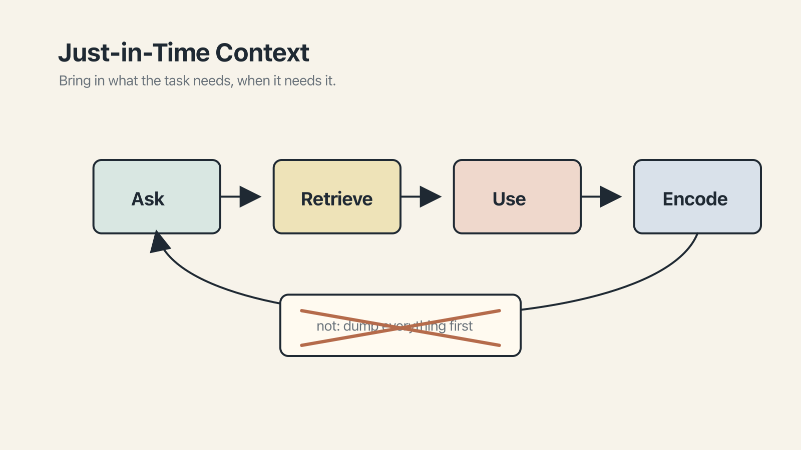

# Chapter 14 — Just-in-Time, Not Just-in-Case

There is a common first instinct, when handed a larger context window, which is to fill it.

You have a thousand-page document. The window holds a million tokens. It fits! *Upload it,* says the marketing copy, encouragingly. You upload it. You ask the question.

This, as almost everyone who has tried it eventually learns, works less well than you would hope. You have read the first three chapters of this book; you know why. A window that contains everything contains most things in the middle, and the middle — as Nelson Liu and his colleagues established, and as every benchmark since has confirmed — is where attention goes thin. A document dumped into context is a document most of which the model will skim.

There is a better approach, which the Anthropic engineering team named in their 2025 writeup on [effective context engineering](https://www.anthropic.com/engineering/effective-context-engineering-for-ai-agents) and which has since become the standard recommendation among serious practitioners. It is called **just-in-time retrieval**, and the principle behind it can be stated in one sentence: *give the agent pointers, not payloads.*

## The payload approach and why it falls down

Let me describe the payload approach in its most innocent form, because it is genuinely tempting and it is how most people start.

You have, say, a customer-research archive — a hundred interviews, each five thousand words, collected over the past year. You want an AI to synthesize patterns from it. The payload approach is to attach all hundred interviews to the prompt, along with the question, and wait for the answer.

What happens is, roughly, what happened in the earlier chapters: the model does its best, but the half-million tokens you've just handed it don't all fit in the usable context, even when they technically fit in the *advertised* context. Some interviews get more attention than others. The ones in the middle of the pile get the least. The synthesis that comes back is plausible, often quite good, but it is biased by which interviews the model happened to attend to more carefully — which, since you gave no indication of priority, was mostly about position. The most recent and the earliest interviews were read carefully. The sixty in the middle were skimmed.

This is not a hypothetical failure mode. It is the dominant failure mode for tasks involving large corpora.

## What just-in-time looks like

The just-in-time pattern, by contrast, gives the model a way to *find* the relevant material rather than handing over the whole pile at once.

In its simplest form, this is a filesystem or a directory listing. You point the model at a folder — `interviews/2025/` — and tell it that when it needs specific material, it should read the relevant files by name. The model does not have every interview in context. It has a *map* of every interview. When it needs interview number fifty-seven, because the conversation has turned to pricing-tier questions and interview fifty-seven is where those came up, it reads interview fifty-seven. At that moment, and not before.

The mechanics vary by tool — filesystem reads in Claude Code, `@`-mentions in Cursor, `/read` in Aider, file-scoped search in ChatGPT Projects. **MCP servers** make the pattern cross-vendor. The details differ. The idea is the same: keep the heavy material out of the default window, and retrieve only what the current question needs.

The payoff is twofold. First, the context is smaller, and the smaller context is sharper — the model attends more carefully to what is in front of it. Second, the retrieval is *targeted*: the model brings in the relevant three interviews instead of scanning a hundred. The synthesis built on three carefully-read interviews is, more often than not, better than the synthesis built on a hundred lightly-read ones.

## The Anthropic recommendation

The Anthropic engineering post from September 2025 made the case in terms worth paraphrasing, because they generalize:

> Find the smallest possible set of high-signal tokens that maximize the likelihood of some desired outcome. Treat context as a finite resource with diminishing marginal returns.

That is about as clean a statement of the principle as you will find. The framing — context as finite, with *diminishing* marginal returns — is the thing to carry. The second document you add might help. The fiftieth probably doesn't. The hundredth is, quite possibly, actively hurting.

Most first-time prompt designers think they are optimizing for *recall* — making sure the model has access to anything it might need. What they are actually doing is degrading *precision* — making the model's attention thinner across more material than it can usefully read.

## A brief aside on chunking

If you are ever drawn into building your own retrieval system — where a large corpus is broken into pieces, embedded, and retrieved on demand — two findings from the 2024–2025 research are worth knowing. First, the way you chunk matters more than the raw size of your window; thoughtful chunking routinely outperforms larger, less-selective approaches. Second, when you do load multiple chunks into a prompt, put the most important at the end, closest to the question. Recency and proximity are where attention is sharpest.

These are details for the curious. The main principle — fewer, better-chosen chunks beat more, indiscriminate ones — is the same one that runs through this whole chapter.

## When the payload approach is right

Not every case benefits from just-in-time. There are two situations where a direct payload is the better choice.

The first is when the document is *small* — within, say, a few thousand tokens — and the question is genuinely about the whole of it. Summarize this eight-page memo. Find the main argument of this article. Translate this short story. For short inputs, attaching the full text is simpler and works well.

The second is when the task genuinely requires the *whole* corpus and the corpus is small enough to fit well within the effective context window. If the model needs to count how many times a phrase appears in a document, or identify the only passage that mentions a specific person, the payload approach is what you want — provided the document fits in the window you actually have usable, not the one advertised.

The mistake is to treat the payload approach as the default and just-in-time as an exotic technique. For most work, the reverse is closer to the truth.

## For Monday

Two habits.

First, before your next long-document task, ask: *does the model need to see all of this at once, or only the parts relevant to the current question?* If the second, give it the map — where the documents live, how they're organized — and let it retrieve.

Second, when you notice yourself about to attach a long document to a prompt, pause. Ask yourself if there is a one-page summary you could attach instead, with the full document available via a pointer. Nine times out of ten, there is.

The model, assisted in this way, is doing more real work and less skimming. Your output will show it.
