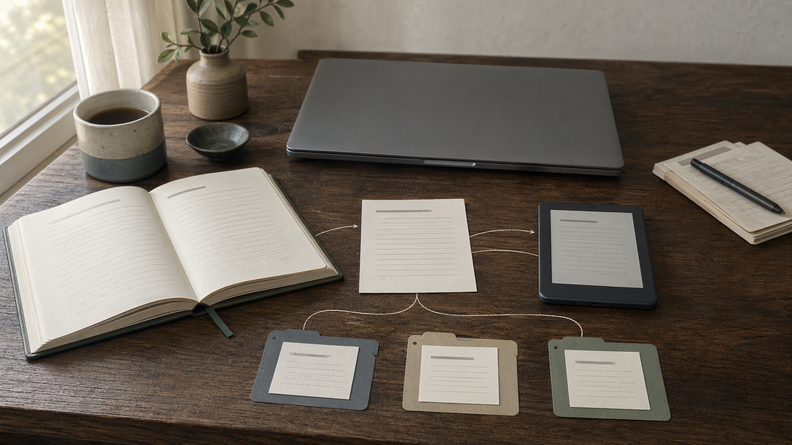

# Chapter 16 — Why Markdown Won

In 2004, a Philadelphia-based blogger named John Gruber, with some input from Aaron Swartz, introduced a lightweight markup language he called **Markdown**. The pitch, which Gruber made with his characteristic restraint, was that it was a way to write formatted text that also looked perfectly readable without being rendered — asterisks for emphasis, pound signs for headers, hyphens for bullet points, that sort of thing.

Nobody particularly noticed.

Twenty-odd years later, Markdown has turned out to be one of the most thoroughly victorious formats in the history of software. It is what GitHub READMEs are written in. It is what Slack interprets when you put an asterisk around a word. It is the default in Notion, Obsidian, Bear, Craft, and most of the serious note-taking tools of the last decade. It is how Stack Overflow works. It is how every LLM-facing rules file — `CLAUDE.md`, `AGENTS.md`, `GEMINI.md`, `CONVENTIONS.md`, the Cursor `.mdc` files — structures its content.

This was not inevitable. There were other formats in the running. And yet, quietly and over about fifteen years, Markdown won.

## The competitors

It helps to remember what it beat. **XML** was for a decade the official answer to *how should humans and machines exchange structured text?* It is precise, unambiguous, machine-readable, and exhausting to write by hand. Computers loved it; humans avoided it, which is exactly what most humans did. **YAML** was the tidier reply — indentation instead of closing tags — and remains excellent for configuration, but prose doesn't naturally want to live inside a key-value shape. **JSON** is the lingua franca of machine-to-machine exchange and almost unreadable as a document format; nobody writes a README in JSON. And **rich text** — DOCX, PDF, and their kin — is designed for rendering to a page: binary, painful to diff, painful to search. You cannot `grep` a PDF.

Into this field stepped Markdown, with a proposition that seemed almost too modest to matter: *plain text with light punctuation, readable as-is, structured enough to render when you want.*

## Why it keeps winning

Five properties, roughly in order of how much each matters.

It is **readable without a renderer**. A Markdown file opened in any text editor looks fine. You can read one the way you read a letter; you don't need software to parse it for you. This matters enormously for files read by both humans and machines, which is what most AI-adjacent context files are.

It is **trivially parseable**. Any language has a Markdown parser available as a short library. LLMs read it fluently without preprocessing, because they were trained on a very great deal of it.

LLMs **write it as well as they read it**. This is the underappreciated one. Ask an AI to generate a document and Markdown is almost always what comes out most cleanly. The models have been trained on oceans of it — GitHub READMEs, Stack Overflow, technical blog posts, the entire Python documentation — and they are fluent in it in a way they are not quite fluent in reStructuredText or AsciiDoc. The output is the input. The feedback loop reinforces.

It has **no schema argument**. A Markdown file can be six lines or six hundred, prose or bullets, strict outline or free jazz. There is no committee-approved ontology. Nobody is going to reject your `AGENTS.md` because it doesn't match a spec. This sounds like a weakness and turns out to be a strength: no team is ever waiting on a standards body to settle an argument about whether their file is valid.

It **plays well with version control**. A Markdown file diffs cleanly, line by line. Merge conflicts are, while not always pleasant, at least legible. Compare a Word document, where changing a single word can alter a dozen bytes of embedded metadata and produce a diff that looks like static.

None of these properties were designed for LLMs. Markdown predates the modern wave of language models by over a decade. The format was built for bloggers. That it turned out to be the ideal format for LLM context is, if you want to see it that way, a pleasant accident of history — like discovering that the thing you had in the cupboard was exactly what you needed, and nobody had to invent anything.

## What this means for your files

A practical consequence, for anyone writing context for AI in 2026: **write it in Markdown unless there's a specific reason not to.**

Your rules files should be Markdown. Your project notes, if you want an AI to eventually read them, should be Markdown. Your team's internal wiki, if you have a choice, should support Markdown export. Your personal notes, if you use them for context in AI sessions, should be Markdown.

This is a matter of *portability*. A Markdown file will be readable by any AI tool you might use now or three years from now. A document in a proprietary format needs to be exported, converted, or extracted. The friction of that step, repeated often, is what separates a fluid working practice from a sticky one.

If you are starting a new personal-knowledge system, choose tools whose native format is Markdown. Obsidian stores vaults as Markdown files. Bear exports cleanly. Notion has reasonable Markdown export, though its native format is not Markdown. Apple Notes, Google Docs, and proprietary email clients are, on this axis, worse choices — not because they lack features but because the friction to get your notes into an AI's hands is higher.

## A small historical irony

When Gruber introduced Markdown in 2004, he made clear it was not meant to replace HTML. The plain-text syntax would be rendered to HTML for display; Markdown was a typing shortcut, not a document format.

Two decades on, the rendering step has become optional. Most of the places Markdown now lives — rules files, configuration, notes, chat messages — are consumed in their plain-text form, by software and by people, without ever being rendered to HTML. The source has become the artifact. What started as a convenient way to write HTML has become, in its own right, the document format of a considerable portion of the written-for-machines internet. Most formats start as structured data and accumulate human-readable renderings. Markdown went the other way.

## For Monday

One small recommendation, barely an exercise.

If you are choosing a new tool — for notes, documentation, project management, anything with textual content — check what format it exports to and imports from. If Markdown appears on both sides, the tool will play nicely with your AI in 2026 and with whatever AI comes next. If it doesn't, the tool is imposing friction on your future working practice.

This is not a call to evangelism. You do not need to switch notes apps. But when the next switch happens — and it always does, eventually — the format matters more than the features. The features will change. The format will not.

Markdown won. Act accordingly.
