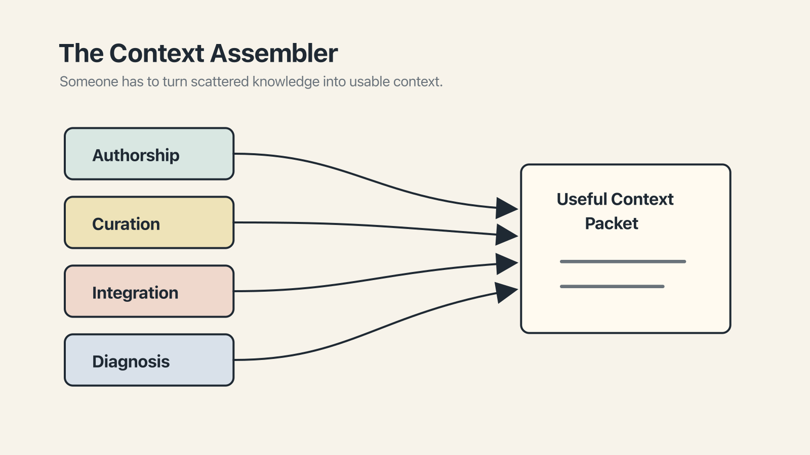

# Chapter 24 — The Context Assembler

One of the minor, reliable pleasures of watching a new technology mature is observing which roles emerge around it.

Web browsers produced webmasters, then frontend engineers, then design systems leads. Databases produced DBAs, then data engineers, then analytics engineers. Each time, a set of responsibilities that had been diffuse — shared across a team, under-owned, often done badly — cohered into a distinct role. The person doing the job got a title. The title got a salary band. The salary band got a career ladder. Within a few years, the thing that had once been a collection of miscellaneous chores was a profession.

Working with AI is, at the time of this writing, somewhere in the middle of the same process. The role that is emerging has several names — *AI engineer, prompt engineer, agent architect* — and none of them quite fit. The name I find most accurate, and the one I'll use here, is **context assembler**.

The context assembler is the person on a team whose job is to own the context that the team's AI tools work from. Rules files. Skills and agents. Knowledge systems. MCP servers. Memory configuration. Evaluation suites. The parts of the system that determine, at any given moment, what the AI sees and how it behaves.

## Why the role exists

The naive assumption, when AI tools arrived in earnest, was that they would *reduce* the need for specialized work. The AI would do the work; the humans would supervise. No special skill required.

What has happened instead is more nuanced. AI tools have made individual contributors more productive — designers, engineers, PMs, writers — but only when the AI has access to the right context. An AI with a bad rules file, outdated memory, missing integrations, and un-curated knowledge is an AI producing generic output at volume. An AI with a well-maintained context apparatus is, for specific kinds of work, genuinely valuable.

The gap between those two states does not close by itself. Somebody has to maintain the context. Somebody has to write the rules files and prune the stale ones, evaluate and promote successful prompt patterns into skills, stay on top of which MCP servers are worth adding and which memory approach suits the team. This work does not fit neatly into any of the pre-AI roles. It is, in structure and sensibility, its own thing.

Left unowned, it decays. Teams that ignore the role end up with a sprawl of half-maintained context files, agents that worked six months ago and don't now, and AI tooling that produces disappointing output for reasons nobody can diagnose. Teams that assign the role — even informally, even part-time — see compounding improvements over quarters, not weeks.

## What the work actually is

Four recurring threads.

**Authorship** — writing the rules files, skills, and system prompts, and editing what others contribute. **Curation** — pruning stale rules, consolidating duplicates, promoting successful patterns into reusable skills, retiring skills that no one uses. **Integration** — choosing and maintaining the tooling around the AI: memory approach, MCP servers, evaluation suite, observability. **Diagnosis** — when the AI starts producing worse output than it used to, figuring out why.

Curation deserves a word more than the others, because it is the most under-appreciated. It is the janitorial half of the role — consolidating, pruning, promoting, retiring — and it is what separates a team whose AI tooling compounds from one whose tooling accretes. A rules file that grows without editing becomes, within a quarter or two, a rules file nobody reads. Most of the day-to-day work of the role is curation and diagnosis; authorship and integration happen in bursts, usually when something is being set up or reorganized.

## The role at different scales

The role scales with team size, unevenly.

**Small teams** (up to ~20 developers) can run it part-time: a senior engineer or tech lead wearing the hat perhaps a day a week, maintaining `AGENTS.md`, writing core skills, answering AI-usage questions. Sustainable without a dedicated hire.

**Medium teams** (50–150) outgrow the part-time shape. The natural evolution is a full-time owner, either a senior engineer pivoting in or a new hire. The title varies; the work is recognizable.

**Large organizations** (500+) federate. A small center of excellence (two to five people) owns cross-cutting patterns and shared infrastructure; each product team has a local owner at one or two days a week who handles team-specific rules and escalates cross-cutting questions upward.

This pattern — part-time → full-time → federated — is not unique to this role. It is roughly the same shape as the maturation of DevOps, design systems, or internal platforms. The forces that produced those patterns are producing this one, and the organizational answers will probably converge as well.

## How the role fits with existing titles

*Is this an engineering job or a product job?* Both, and neither. It is not purely engineering because much of the work is authorship — writing instructions, curating knowledge — closer to technical writing or PM work than coding. It is not purely product because much of it is implementation — wiring MCP servers, debugging eval suites, maintaining skill definitions. The best context assemblers I have seen come from engineering backgrounds and have strong taste for writing and organizing information. They can read a stack trace, write a spec, evaluate a design decision, and prune a rules file, sometimes in the same afternoon. The mixture is uncommon, and increasingly valuable.

## If there is no one in the role yet

Which today is most teams. Two paths.

One is to propose the role formally: make the case that someone should be given explicit responsibility for the team's AI context apparatus, at some fractional allocation, with the understanding that it will grow as AI usage grows.

The other is to simply start doing the work. Take ownership of the `AGENTS.md` at your repo root. Propose a skill when you notice a recurring prompt. Fix stale rules in the files you notice going unmaintained. You will, within a few months, have accumulated enough de facto ownership that the formal designation will either arrive or become unnecessary.

Either path works. Neither is easier than it sounds. But the work is valuable, it compounds, and it is notably the kind of work that the AI itself cannot yet do — the curation of what the AI sees and how it behaves is, in the reasonable near future, a human responsibility.

That closes the chapter, and with it the substantive content of the book. One more chapter remains, which is less a chapter than a send-off.
